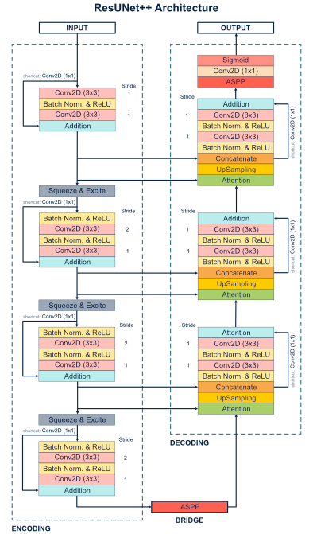
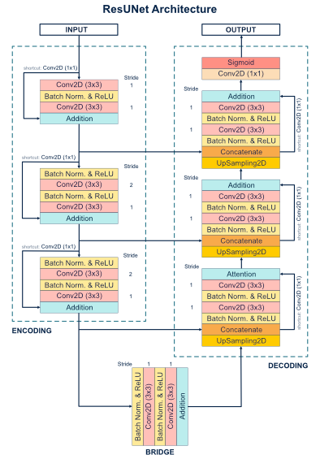
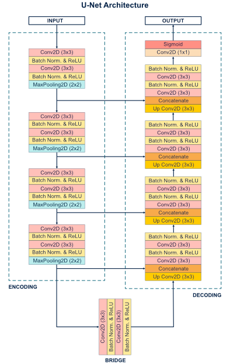
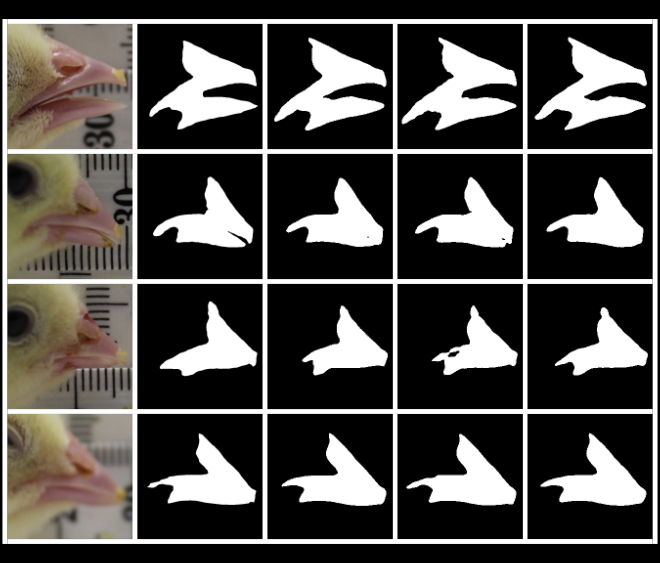

# Chick image segmentation using ResUNett++
Image segmentation of day-old chicks for gendering using tensorflow implementation of ResUNet++.

# ResUNet++
The ResUNet++ architecture is based on the Deep Residual U-Net (ResUNet), which is an architecture that uses the strength of deep residual learning and U-Net. The proposed ResUNet++ architecture takes advantage of the residual blocks, the squeeze and excitation block, ASPP, and the attention block. 
More description about the archicture can be in the paper [ResUNet++: An Advanced Architecture for Medical Image Segmentation] (https://arxiv.org/pdf/1911.07067.pdf).

## Architecture

### ResUNet++

### ResUNet

### UNet

## Requirements:
	os
	numpy
	cv2
	tensorflow
	glob
	tqdm

## Folders:
    data:
      raw_dataset: Raw uncropped data of day old chicks; images, masks and json file for mask and bounding boxes.
      dataset: Cropped data from raw_dataset based on process_image.py
    new_data: Contains train-valid-test split of images and masks. Train subfolder contians augmented images and masks from process_image.py 
	files: Contains the csv file and weight file generated during training.
	results: Contains images of infered/testing results

## Files:
	1. process_image.py: Crop raw_dataset, augment the images and mask for the training dataset.
	2. data_generator.py: Dataset generator for the keras.
	3. infer.py: Run your model on test dataset and all the result are saved in the result` folder. The images are in the sequence: Image,Ground Truth Mask, Predicted Mask.
	4. run.py: Train the unet.
	5. unet.py: Contains the code for building the UNet architecture.
	6. resunet.py: Contains the code for building the ResUNet architecture.
	7. m_resunet.py: Contains the code for building the ResUNet++ architecture.
	8. mertrics.py: Contains the code for dice coefficient metric and dice coefficient loss. 

## First check for the correct path and the patameters.
1.	python3 process_image.py - to augment training dataset.
2.	python3 run.py - to train the model.
3.	python3 infer.py - to test and generate the mask.

## Results
Qualitative results comparison on the chick beak dataset. From the left: Image (1), (2) Ground truth, (3) ResUNet++, (4)
ResUNet, and (5) UNet.  

## Citation
ResUNet++ Architecture and code: 
<pre>
Jha, D., Smedsrud, P. H., Riegler, M. A., Johansen, D., Lange, T. D., Halvorsen, P., & D. Johansen, H. (2019).
ResUNet++: An Advanced Architecture for Medical Image Segmentation.
2019 IEEE International Symposium on Multimedia (ISM), 225–2255.
https://doi.org/10.1109/ISM46123.2019.00049
</pre>

ResUNet Architecture:
<pre>
Zhang, Z., Liu, Q., & Wang, Y. (2018).
Road Extraction by Deep Residual U-Net.
IEEE Geoscience and Remote Sensing Letters, 15(5), 749–753.
https://doi.org/10.1109/LGRS.2018.2802944
</pre>

UNet Architecture:
<pre>
Ronneberger, O., Fischer, P., & Brox, T. (2015).
U-Net: Convolutional Networks for Biomedical Image Segmentation.
In N. Navab, J. Hornegger, W. M. Wells, & A. F. Frangi (Eds.),
Medical Image Computing and Computer-Assisted Intervention – MICCAI 2015 (pp. 234–241).
Springer International Publishing.
https://doi.org/10.1007/978-3-319-24574-4_28
</pre>
